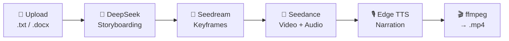
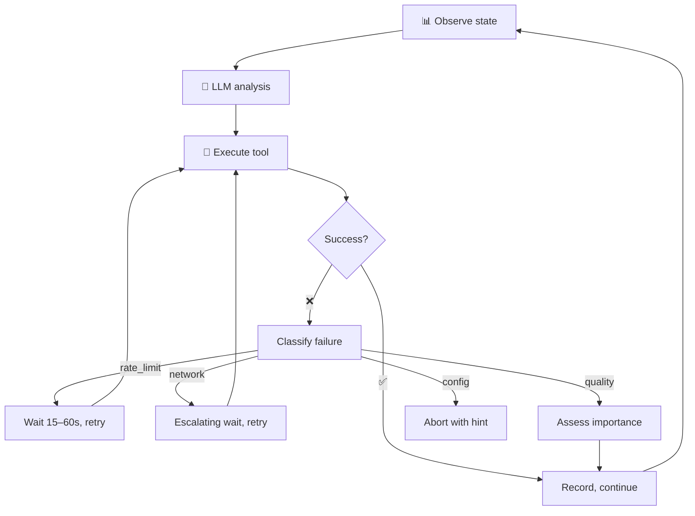

<p align="center">
  <h1 align="center">🎬 Zhiyan</h1>
  <p align="center"><strong>Upload a story. Get a film.</strong></p>
  <p align="center">
    
    
    
  </p>
</p>

---

You write the story. Zhiyan directs, shoots, and edits it — fully automated, from script to finished video.

Not "generate a video clip." A complete short film: shot-by-shot storyboarding, character-consistent keyframes, video generation with native audio, voice narration, subtitles, background music, and final composition — all in one pipeline.



## 🤖 Agent Mode

Beyond the linear pipeline, Zhiyan ships with a **ReAct Agent engine**. Toggle "Agent Mode" and the LLM takes full control:

- Decides *what to do next* — not a fixed 6-step sequence
- API rate-limited? Waits and retries automatically
- A shot keeps failing? Evaluates importance — skip if transitional, fix prompt if critical
- All decisions streamed to the frontend via SSE in real time



## 🚀 Quick Start

```bash
# 1. Install dependencies
pip install -r requirements.txt

# ffmpeg is required (video composition)
# macOS:  brew install ffmpeg
# Ubuntu: apt install ffmpeg
# Win:    choco install ffmpeg

# 2. Configure API keys
cp .env.example .env
# Edit .env — you need two keys:
#   ARK_API_KEY=...        (Volcengine ARK)
#   DEEPSEEK_API_KEY=...   (DeepSeek)

# 3. Run
python app.py
# Open http://localhost:5000
```

| You need | Where to get it |
|----------|-----------------|
| ARK_API_KEY | [Volcengine ARK Console](https://console.volcengine.com/ark) → API Keys |
| SEEDREAM_ENDPOINT | ARK → Inference → Create Seedream 5.0 endpoint |
| SEEDANCE_ENDPOINT | ARK → Inference → Create Seedance 2.0 endpoint |
| DEEPSEEK_API_KEY | [DeepSeek Platform](https://platform.deepseek.com) → API Keys |

## 📖 Usage

### Browser

1. Open `http://localhost:5000`
2. Choose mode, drag in a `.txt` or `.docx` file
3. Click "Generate" and wait for the pipeline to finish
4. Download the final video

### API

```python
import requests

# Upload document
r = requests.post('http://localhost:5000/api/session/create',
    files={'file': open('story.txt', 'rb')},
    data={'mode': 'auto', 'total_duration': 'auto'})
sid = r.json()['session_id']

# Step through the pipeline
for step in ['design-shots', 'prompts', 'images', 'videos', 'compose']:
    requests.post(f'http://localhost:5000/api/session/{sid}/{step}')

# Download the result
requests.get(f'http://localhost:5000/api/session/{sid}/download')
```

## 🏗️ Architecture

```
story.txt
    │
    ▼
┌─────────────────────────────────────────────────┐
│                 Zhiyan Pipeline                  │
│                                                  │
│  ① Parse ──────▶ ② Storyboard ──▶ ③ Prompts     │
│      │                │               │          │
│      ▼                ▼               ▼          │
│  python-docx     DeepSeek V4    Visual Bible +   │
│                                 per-shot prompt  │
│  ④ Keyframes ──▶ ⑤ Video ──────▶ ⑥ Compose     │
│      │                │               │          │
│      ▼                ▼               ▼          │
│  Seedream 5.0    Seedance 2.0   ffmpeg xfade     │
│  scene reuse     native audio    + subtitles     │
│  5-thread pool   20-thread pool  + BGM           │
└─────────────────────────────────────────────────┘
    │
    ▼
  video.mp4
```

## 📁 Project Structure

```
├── app.py                Flask app + API endpoints
├── config.py             Models, styles, resolutions, i18n
├── agent/                Agent mode (ReAct)
│   ├── core.py             ZhiyanAgent decision loop
│   ├── tools.py            10-tool registry
│   ├── memory.py           Shot state machine
│   ├── planner.py          Failure replan + reflection
│   ├── execution_plan.py   Multi-phase plan tracking
│   └── state_summary.py    Smart state summary
├── services/             Core services
│   ├── llm_service.py      DeepSeek + prompt engineering
│   ├── image_generator.py  Seedream text-to-image
│   ├── pipeline.py         Seedance API wrapper
│   ├── tts_service.py      Edge TTS narration
│   ├── composer.py         ffmpeg video composition
│   └── document_parser.py  .txt/.docx parsing
├── index.html / script.js / styles.css   Frontend SPA
└── i18n/                  zh / en / ja / ko
```

## 📊 Cost

Estimated for a ~40-second short film (8 shots, 720p, 2025 API pricing):

| Step | Usage | Cost |
|------|-------|------|
| Images | 5 API calls (3 reused) | ~$0.10 |
| Video | 38 seconds | ~$4.56 |
| LLM | 3 calls | ~$0.02 |
| Narration | Edge TTS | Free |
| **Total** | | **~$4.70** |

Cost estimate is displayed during the storyboarding phase — no surprises.

## 🔗 API Reference

| Endpoint | Description |
|----------|-------------|
| `POST /api/session/create` | Upload document, create session |
| `POST /api/session/<id>/design-shots` | LLM storyboard design |
| `POST /api/session/<id>/prompts` | Generate image/video prompts |
| `POST /api/session/<id>/images` | Parallel keyframe generation |
| `POST /api/session/<id>/videos` | Parallel video generation |
| `POST /api/session/<id>/compose` | TTS + ffmpeg composition |
| `GET /api/session/<id>/status` | Progress + cost estimate |
| `GET /api/session/<id>/download` | Download final mp4 |
| `GET /api/agent/<id>/stream` | Agent SSE thought stream |
| `GET /api/agent/<id>/state` | Agent state query |

## 📄 License

Apache 2.0
