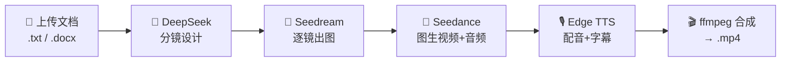
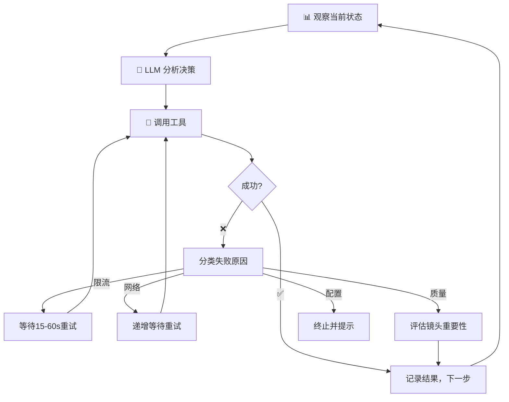

<p align="center">
  <h1 align="center">🎬 Zhiyan</h1>
  <p align="center"><strong>上传文档 → AI 全自动生成视频</strong></p>
  <p align="center">
    
    
    
  </p>
</p>

---

你写故事，Zhiyan 把它拍成电影。

不是"帮你生成一段视频素材"，而是从分镜到成片的全自动导演 —— LLM 读剧本、设计镜头、调度三个 AI 模型协同工作，几分钟输出带配音、字幕、BGM 的完整 mp4。



## 🤖 Agent 模式：AI 自己当导演

除了点击流水线，Zhiyan 内置了一个 **ReAct Agent 引擎**。勾选「Agent 自主模式」后，LLM 接管一切决策：

- 自己判断下一步该做什么（而不是固定 6 步走到底）
- 遇到 API 限流 → 自动等待重试
- 某个镜头一直失败 → 判断是否关键镜头，决定跳过或修改 prompt
- 所有决策通过 SSE 实时推流到前端，你能看到它在"想"什么



## 🚀 Quick Start

```bash
# 1. 安装
pip install -r requirements.txt

# ffmpeg 需系统安装（视频合成用）
# macOS:  brew install ffmpeg
# Ubuntu: apt install ffmpeg
# Win:    choco install ffmpeg 或手动下载

# 2. 配置 API Key
cp .env.example .env
# 编辑 .env 填入两个 Key:
#   ARK_API_KEY=...        (火山引擎方舟)
#   DEEPSEEK_API_KEY=...   (DeepSeek)

# 3. 启动
python app.py
# 浏览器打开 http://localhost:5000
```

| 你需要什么 | 去哪获取 |
|-----------|---------|
| ARK_API_KEY | [火山引擎方舟](https://console.volcengine.com/ark) → API Key 管理 |
| SEEDREAM_ENDPOINT | 方舟 → 模型推理 → 创建 Seedream 5.0 端点 |
| SEEDANCE_ENDPOINT | 方舟 → 模型推理 → 创建 Seedance 2.0 端点 |
| DEEPSEEK_API_KEY | [DeepSeek 开放平台](https://platform.deepseek.com) → API Keys |

## 📖 使用

### 浏览器

1. 打开 `http://localhost:5000`
2. 选择模式 → 拖入文档 → 点击「开始生成」
3. 等待流水线完成，下载视频

### API

如果你想在自己的应用里调用：

```python
import requests

# 上传文档
r = requests.post('http://localhost:5000/api/session/create',
    files={'file': open('story.txt', 'rb')},
    data={'mode': 'auto', 'total_duration': 'auto'})
sid = r.json()['session_id']

# 逐步推进流水线
for step in ['design-shots', 'prompts', 'images', 'videos', 'compose']:
    requests.post(f'http://localhost:5000/api/session/{sid}/{step}')

# 下载成品
requests.get(f'http://localhost:5000/api/session/{sid}/download')
```

完整 API 端点见下方。

## 🏗️ 架构

```
story.txt
    │
    ▼
┌─────────────────────────────────────────────────┐
│                 Zhiyan Pipeline                  │
│                                                  │
│  ① 文档解析 ──▶ ② 分镜设计 ──▶ ③ Prompt 生成   │
│       │              │               │           │
│       ▼              ▼               ▼           │
│   python-docx    DeepSeek V4    视觉圣经+逐镜    │
│                                                  │
│  ④ 图片生成 ──▶ ⑤ 视频生成 ──▶ ⑥ 合成输出      │
│       │              │               │           │
│       ▼              ▼               ▼           │
│   Seedream 5.0  Seedance 2.0    ffmpeg xfade     │
│   同场景复用     原生音频生成    + 字幕 + BGM    │
│   5线程并行      20线程并发                       │
└─────────────────────────────────────────────────┘
    │
    ▼
  video.mp4
```

## 📁 项目结构

```
├── app.py                Flask 主程序 + API
├── config.py             模型/风格/分辨率/多语言
├── agent/                Agent 模式 (ReAct)
│   ├── core.py             ZhiyanAgent 决策循环
│   ├── tools.py            10 个工具注册与实现
│   ├── memory.py           镜头状态机 + 工作记忆
│   ├── planner.py          失败重规划 + 决策反思
│   ├── execution_plan.py   多阶段执行计划
│   └── state_summary.py    智能状态摘要
├── services/             核心服务
│   ├── llm_service.py      DeepSeek + Prompt 工程
│   ├── image_generator.py  Seedream 文生图
│   ├── pipeline.py         Seedance API 封装
│   ├── tts_service.py      Edge TTS
│   ├── composer.py         ffmpeg 合成
│   └── document_parser.py  .txt/.docx 解析
├── index.html / script.js / styles.css   前端 SPA
└── i18n/                  zh / en / ja / ko
```

## 📊 成本

以愚公移山为例（8 镜 × 38 秒，720p，2025 年 API 定价）：

| 步骤 | 调用 | 费用 |
|------|------|------|
| 图片 | 5 次（3 次复用节省） | ~$0.10 |
| 视频 | 38 秒 | ~$4.56 |
| LLM | 3 次 | ~$0.02 |
| 配音 | Edge TTS | 免费 |
| **合计** | | **~$4.70** |

启动后在分镜设计阶段即可看到预估成本，不需要等全部跑完才知道花了多少钱。

## 🔗 API 端点

| 端点 | 说明 |
|------|------|
| `POST /api/session/create` | 上传文档，创建会话 |
| `POST /api/session/<id>/design-shots` | DeepSeek 分镜设计 |
| `POST /api/session/<id>/prompts` | 生成 image/video prompt |
| `POST /api/session/<id>/images` | Seedream 并发出图 |
| `POST /api/session/<id>/videos` | Seedance 并发生视频 |
| `POST /api/session/<id>/compose` | TTS + ffmpeg 合成 |
| `GET /api/session/<id>/status` | 进度 + 成本预估 |
| `GET /api/session/<id>/download` | 下载成品 mp4 |
| `GET /api/agent/<id>/stream` | Agent SSE 思考流 |
| `GET /api/agent/<id>/state` | Agent 状态查询 |

## 📄 License

MIT — 随便用，改，分发。
